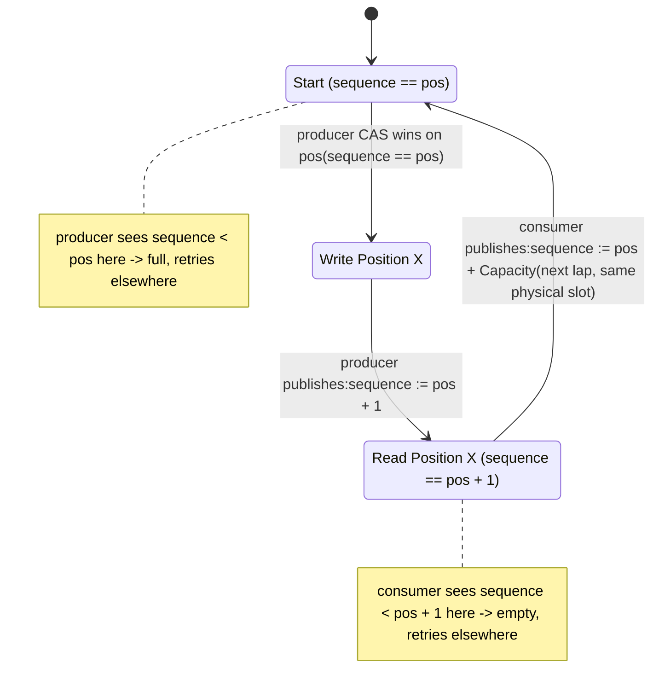

# Introduction #
#MPMC_Queue

The MPMC Queue is a `Multi-Producer, Single-Consumer` lock free FIFO queue. Many threads can write to the queue, and many threads can read the from the queue. It will be built on a _fixed size ring buffer that utilizes a state machine for each index_.
# Implementation
This document is to cover a "Paper" version of the queue before jumping into development,
same as SPSC_Paper_Design.md. The following sections cover functions and their expected
functionality.

## Why SPSC's approach breaks with multiple writers ##

Unlike our SPSC queue which only allowed a single writer, and a single reader, we now have many threads capable of reading or writing. That is, we can have an unlimited amount of threads changing our tail, or our head index, while still needing to maintain order. 

We write on tail, so imagine we have two threads. Thread 1 gets position 5, thread 2 gets position 6, but thread 1 gets rescheduled before the write actually occurs, where as thread 2 writes instantly. Our tail now reads 7, but position 5 is not actually written yet. As such, we must force ordering such that position 5 occurs before 6. Otherwise we could have head trying to read a value that was never actually written.

## Strategy ##


We will utilize a state machine for each indice of the buffer, such that we always have a way to determine if it is being wrote, is successfully wrote, being read, or is clean. `Sequence` is the state machine value.



Note: `sequence` itself only ever holds two values per lap, `pos` and `pos + 1`. It can't tell
Start apart from mid-write (both read `pos`), or Read-ready apart from mid-read (both read
`pos + 1`). Whoever holds the CAS win on `enqueue_pos_`/`dequeue_pos_` is what actually owns the
cell during those two in-progress states, so this diagram is the slot's logical state, not
something we can read straight off `sequence`.

## Class Variables ##

<!-- TODO: What does each slot hold beyond T value? Vyukov's design adds one field to the
slot itself, atomic. What is it, what type, and why per-slot instead of relying only on a
shared head_/tail_ pair? Also: capacity constraint (same power-of-2 reasoning as SPSC?),
and what head_/tail_ still do vs. what the old SPSC head_/tail_ did. -->

```cpp
public:
private:

struct alignas(CACHE_LINE_SIZE) Slot {
	T value;
	std::atomic<std::size_t> sequence;
};

std::array<Slot, Capacity> buf_;
alignas(CACHE_LINE_SIZE) std::atomic<std::size_t> enqueue_pos_{0}; // write pos
alignas(CACHE_LINE_SIZE) std::atomic<std::size_t> dequeue_pos_{0}; // read pos

```
Capacity is a **compile-time template parameter**, so validation must happen at compile time. We will use a `static_assert`:
```cpp
static_assert((Capacity & (Capacity - 1)) == 0, "Capacity must be power of 2");
```

**Free-running indices (wraparound design decision):** `head_` and `tail_` **never reset to zero**. They increment monotonically forever. Wraparound happens only when indexing into the buffer: `buf_[t & (Capacity - 1)]`. This is a deliberate choice — it makes full/empty unambiguous without a sentinel slot or a separate count:
- **Empty:** `head_ == tail_`
- **Full:** `tail_ - head_ == Capacity`

## Public Worker Functions ##

### bool try_push(const T& item) ###

try_push is the *producer* and will be utilized to push items into the queue. That is, it we *release publishers, and acquire observers*. It shall:
1. Load `enqueue_pos_` with `std::memory_order_relaxed`. `enqueue_pos_` is only wrote by try_push, *however* many threads could write to it. This means we will need CAS later, however the addition of our sequence will help correct as well in case we get a stale `enqueue_pos_`.
2. We then need to load our sequence with `std::memory_order_acquire`.  Our load must synchronize with our consumers release-store from the previous lap. If `sequence == pos` then we can claim the spot. Else if `sequence < pos` means we have yet to catch up from our previous lap. So it is full, and we must return false. Otherwise, if `sequence > pos`, another producer already claimed this, so we must reload `enqueue_pos_`
3. Using Compare and Swap we claim the position by operating on `enqueue_pos_`.
4. After the write is finalized, we then update the sequence. When updating the sequence we do index + 1, such that we point to the next free space.
5. Once we have finalized updating the sequence, we store `enqueue_pos_` + 1 with std:memory_order_release

```cpp
bool try_push(const T& item) {
    auto pos = enqueue_pos_.load(std::memory_order_relaxed);
    // No dequeue_pos_ read here — SPSC needs the other side's counter for its full check,
    // MPMC gets the same answer locally from this one slot's sequence instead.
    while(true) {
	    Slot& slot = buf_[pos & (Capacity - 1)];
		const auto sequence = slot.sequence.load(std::memory_order_acquire);
        const auto dif = static_cast<std::ptrdiff_t>(sequence) - static_cast<std::ptrdiff_t>(pos); // size_t is unsigned, this forces signed subtraction, ptrdiff_t is specifically defined to match the width needed to represent a pointer/size difference on the target platform

        if (dif == 0) {
            // This cell is exactly at the state pos expects — try to claim it.
            if (enqueue_pos_.compare_exchange_weak(pos, pos + 1, std::memory_order_relaxed)) {
                slot.value = item;
                slot.sequence.store(pos + 1, std::memory_order_release);
                return true;
            }
            // CAS failed: pos was refreshed to the current enqueue_pos_ automatically — retry.
        } else if (dif < 0) {
            return false; // full: this cell hasn't been drained from its previous lap yet
        } else {
            pos = enqueue_pos_.load(std::memory_order_relaxed); // another producer claimed pos first — reload and retry
        }
        #if defined(__aarch64__)
		    __builtin_arm_yield();
		#elif defined(__x86_64__)
		    _mm_pause();
		#endif
    }
}
```

### bool try_pop(T& out) ###
try_pop is our *consumer* and will be used to pop data out of our buffer. It will:
1. Load `dequeue_pos_` utilizing std::memory_order_relaxed. Even though multiple threads will be reading this, our Compare and Swap as well as sequence will help correct if we grab a statle `dequeue_pos_`.
2. Using `std::memory_order_acquire` we load the sequence number. Using dif = seq - (pos + 1) we have
	1. dif == 0 -> claim
	2. dif < 0 -> Empty, no producer has published yet.
	3. dif > 0 -> already claimed by another consumer, retry.
3. Using compare and swap, check the head is correct. If it is correct, we consume the value, update seqyebce too pos, and return true.

```cpp
bool try_pop(T& out) {
    auto pos = dequeue_pos_.load(std::memory_order_relaxed);
    // No dequeue_pos_ read here — SPSC needs the other side's counter for its full check,
    // MPMC gets the same answer locally from this one slot's sequence instead.
    while(true) {
	    Slot& slot = buf_[pos & (Capacity - 1)];
		const auto sequence = slot.sequence.load(std::memory_order_acquire);
        const auto dif = static_cast<std::ptrdiff_t>(sequence) - static_cast<std::ptrdiff_t>(pos + 1); // size_t is unsigned, this forces signed subtraction, ptrdiff_t is specifically defined to match the width needed to represent a pointer/size difference on the target platform

        if (dif == 0) {
            // This cell is exactly at the state pos expects — try to claim it.
            if (dequeue_pos_.compare_exchange_weak(pos, pos + 1, std::memory_order_relaxed)) {
                out = slot.value;
                slot.sequence.store(pos + Capacity, std::memory_order_release);
                return true;
            }
            // CAS failed: pos was refreshed to the current dequeue_pos_ automatically — retry.
        } else if (dif < 0) {
            return false; // empty: this cell hasn't been producedd from its previous lap yet
        } else {
            pos = dequeue_pos_.load(std::memory_order_relaxed); // another consumer claimed pos first — reload and retry
        }
        #if defined(__aarch64__)
		    __builtin_arm_yield();
		#elif defined(__x86_64__)
		    _mm_pause();
		#endif
    }
}

```

## Additional Correctness Notes ##

**Memory orders, and why each one is the minimum we actually need:**

The initial load on `enqueue_pos_`/`dequeue_pos_` is relaxed. It's just producing a candidate
`pos` to try, nothing to synchronize with yet, since the sequence check right after is what
actually validates it.

The slot's `sequence` load is the one that needs acquire. It has to synchronize with the
previous occupant's release-store into that same field — the last consumer's
`sequence := pos + Capacity` for `try_push`, or the last producer's `sequence := pos + 1` for
`try_pop`. Without acquire here we have no guarantee the previous occupant finished touching
`.value` before we start touching it ourselves. That's a real data race, not a theoretical one.

The CAS on `enqueue_pos_`/`dequeue_pos_` only needs relaxed, on both success and failure. Its job
is just deciding which one thread claims the position, it isn't publishing or consuming any
data, so it doesn't need to carry synchronization. All the actual visibility guarantees come
from the acquire/release pair on `sequence`.

The final `sequence.store` is release. It's the publish — what makes the plain write to `.value`
we just did visible to whoever's acquire load reads this value next. Get this pairing wrong and
the whole thing breaks silently under real contention while still passing a single-threaded
test.

Same reasoning as SPSC's "why not seq_cst everywhere": acquire/release gives us exactly the
happens-before edge we need and nothing more. `seq_cst` would force a global total order across
every `sequence` operation in the queue, which we're not asking for.

**Why a sequence number instead of a ready flag:** a bool can only tell you a slot is occupied,
not which lap's data is sitting in it. A consumer that gets delayed long enough could come back
after a producer has wrapped all the way around and refilled the same physical slot. A flag
flipping true/false looks identical across laps — there's no way to tell lap 3's data from lap
4's. Same bug shape as `broken_aba.cpp`, just moved into a ring buffer. Encoding the actual
expected position (`pos`, `pos + 1`, `pos + Capacity`...) into `sequence` fixes that, since the
comparison is an exact match against one specific lap — a stale read from the wrong generation
can't satisfy `dif == 0` by accident.

**Lock-free, not wait-free:** this design is lock-free, not wait-free. Lock-free just means some
thread is always making progress system-wide, even if one specific thread gets unlucky and
starved. If producer A keeps losing the CAS race to other producers it could spin for a while,
but the system as a whole keeps moving. Wait-free would mean every thread finishes in a bounded
number of steps no matter what, and we don't have that here since the retry loop has no bound
under bad scheduling. One producer spinning never blocks a consumer, or vice versa, though —
`enqueue_pos_` and `dequeue_pos_` are separate atomics, and the only thing both sides touch is a
slot's `sequence` field, which nobody locks, they just read and CAS it.

**Contention and backoff:** both retry paths — a lost CAS, and someone else already claiming
`pos` — fall through to a platform-guarded pause/yield hint (`_mm_pause()` /
`__builtin_arm_yield()`, same pattern as `cas_spinlock.cpp`) before looping again. Doesn't change
correctness, it's just a hint that this is a spin-wait, which cuts power draw, avoids a
misprediction penalty when the loop exits, and is nicer to a sibling SMT thread on the same core.
There's no backoff past that single pause right now, no fallback to
`std::this_thread::yield()` after N failures. Fine under light contention — worth benchmarking
once producer/consumer counts start oversubscribing the core count, same as what the
`cas_spinlock` fairness numbers showed for the spinlock.

# Benchmark and Testing #

Same shape as the SPSC benchmark, just scaled up to multiple producers and consumers.

Baseline is `std::mutex` + `std::queue<T>`, N producer threads and M consumer threads all
fighting over the same lock — the naive comparison any lock-free claim has to beat.

Known implementations to compare against:
- [`boost::lockfree::queue`](https://www.boost.org/doc/libs/1_78_0/doc/html/boost/lockfree/queue.html):
  bounded, Vyukov-style lock-free MPMC queue. Closest apples-to-apples comparison since it's the
  same algorithm family.
- [`moodycamel::ConcurrentQueue`](https://github.com/cameron314/concurrentqueue): the MPMC
  version of `readerwriterqueue` (already used in the SPSC head-to-head), widely used in
  production, but built differently internally (per-producer sub-queues) — worth comparing
  against a single shared ring buffer.

What varies across runs: producer count and consumer count independently (1P/4C, 4P/1C, 4P/4C,
not just matched N/N), `Capacity`, and contended vs. uncontended (pinned to separate cores vs.
oversubscribed). Same methodology as the SPSC head-to-head — `isolcpus`/`pthread_setaffinity_np`
on Linux, pinned threads, `perf stat` for hardware counters.

What we measure: per-op round-trip latency with a percentile breakdown, not just the mean, since
tail behavior is where a lock-free design either pays off or falls apart under contention, plus
aggregate throughput across all producer/consumer threads. Worth tracking CAS failure/retry
counts per op too as producer/consumer counts scale up — actual evidence for how expensive
contention gets, instead of just assuming.
